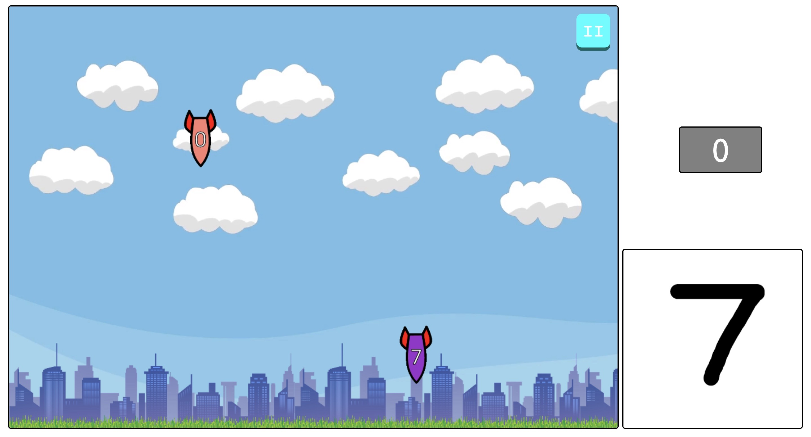

# Magic-Touch-Clone

CONTENTS OF THIS FILE
---------------------
 * Introduction
 * Demo
 * Requirements
 * Installation
 * Configuration

INTRODUCTION
------------

This web application:
- Is a project for my Web Programming class
- Is inspired by the [original Magic Touch](Magic Touch: Wizard for Hire)

The main idea of this game is:
- Player draws the symbols appearing with the enemies.
- The enemies with matched symbols will be defeated.
- If one of the enemies get to the ground, the player loses



DEMO
----
In case you are not interested in how we made the game, you can instantly go to the deployed app:

**[Magic Touch Combi](https://magic-touch-clone.herokuapp.com/)**

REQUIREMENTS
------------

The following tools are required:
* [Git](https://git-scm.com/)
* [NodeJS](https://nodejs.org/en/)
* [ExpressJS](https://expressjs.com/)

The following tools are also recommended: (**to understand how the Machine Learning Algorithm works** but you don't need these to run the app)
* [Python](https://www.python.org/)
* [Keras](https://keras.io/)

INSTALLATION
------------
- Visit [Git](https://git-scm.com/) to install **git** tool.
- Visit [NodeJS](https://nodejs.org/en/) and download your desired drive.
- Run the following commands in your terminal:

```
git clone https://github.com/Combi2k2/Magic-Touch-Clone.git

cd Magic-Touch-Clone
```

If possible, you can start the web app by looking at the next part.

Otherwise, you should install [ExpressJS](https://expressjs.com/) beforehand:
```
npm install express
```

CONFIGURATION
-------------

Sometimes the runtime error happens and collapse the current PORT.

We are not able to predict it so our current solution is change the local PORT:

- The default PORT is 8080. Running
```
node server.js
```
- And the following guide appears:
```
Please go to http://localhost:8080/index.html to see the magic :D
Server is running on PORT 8080
```

- Incase of collapse, we change the PORT to 3000 or whatever we want:

```
PORT=3000 node server.js
```

